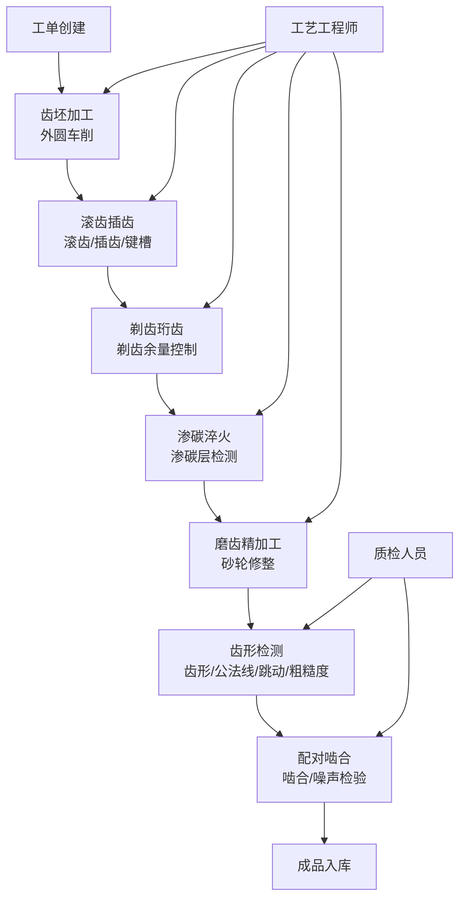

## 1. 产品概述

齿轮加工厂传动齿轮业务客户端软件，专为齿轮制造企业设计的生产全过程管理平台，覆盖从齿坯加工到成品配对啮合的完整工艺流程。系统旨在实现生产数据数字化、工序质量可追溯、关键参数实时监控，提升齿轮加工的精度管理和生产效率。

- 目标用户：齿轮加工厂生产管理人员、工艺工程师、机床操作员、质检人员
- 核心价值：打通齿轮加工全流程数据链，实现工序级质量管控和生产追溯

## 2. 核心功能

### 2.1 用户角色

| 角色 | 注册方式 | 核心权限 |
|------|----------|----------|
| 生产管理员 | 系统分配 | 全部功能，数据统计与报表导出 |
| 工艺工程师 | 系统分配 | 工艺参数设置、技术文档查看 |
| 机床操作员 | 系统分配 | 工序数据录入、加工记录查看 |
| 质检人员 | 系统分配 | 检测数据录入、质量判定 |

### 2.2 功能模块

1. **齿坯加工模块**：齿坯外圆车削记录、毛坯参数管理
2. **滚齿插齿模块**：滚齿加工记录、插齿键槽加工参数
3. **剃齿珩齿模块**：剃齿余量控制、珩齿加工记录
4. **渗碳淬火模块**：齿面渗碳层深度检测、淬火工艺记录
5. **磨齿精加工模块**：磨齿砂轮修整、磨齿加工参数
6. **齿形检测模块**：齿形齿向检测、公法线测量、齿圈径向跳动、齿面粗糙度
7. **配对啮合模块**：齿轮配对啮合、噪声检验、成品入库

### 2.3 页面详情

| 页面名称 | 模块名称 | 功能描述 |
|----------|----------|----------|
| 工作台首页 | 数据概览 | 生产进度看板、待办任务、质量预警、关键指标统计 |
| 工作台首页 | 快捷入口 | 7大模块快速跳转、最近访问记录 |
| 齿坯加工 | 齿坯外圆车削 | 外圆直径、端面跳动、粗糙度、加工参数录入与查询 |
| 滚齿插齿 | 滚齿加工记录 | 滚刀参数、切削参数、齿向误差、齿距累积误差记录 |
| 滚齿插齿 | 插齿键槽 | 插齿刀具参数、键槽宽度与深度、对称度检测 |
| 剃齿珩齿 | 剃齿余量 | 剃前公法线、剃后公法线、剃齿余量计算与控制 |
| 渗碳淬火 | 齿面渗碳层 | 渗碳温度、保温时间、渗碳层深度、硬度检测记录 |
| 磨齿精加工 | 磨齿砂轮修整 | 砂轮型号、修整参数、修整后状态、磨齿精度 |
| 齿形检测 | 齿形齿向检测 | 齿形总偏差、齿形斜率、齿向总偏差、齿向斜率 |
| 齿形检测 | 公法线测量 | 跨齿数、公法线长度、变动量、偏差值计算 |
| 齿形检测 | 齿圈径向跳动 | 跳动测量值、图表展示、合格判定 |
| 齿形检测 | 齿面粗糙度 | Ra/Rz/Rt参数、测量点、检测报告 |
| 配对啮合 | 齿轮配对啮合 | 配对记录、接触斑点、侧隙测量、啮合印痕图 |
| 配对啮合 | 噪声检验 | 噪声分贝值、频谱分析、异常噪声判定 |
| 工单管理 | 工单列表 | 生产工单创建、分配、进度跟踪、完成状态 |
| 工单管理 | 工单详情 | 工单全流程追溯、各工序数据串联查看 |

## 3. 核心流程

齿轮加工遵循"毛坯→粗加工→热处理→精加工→检测→配对"的工艺路线。操作员在系统中选择当前工序，录入加工参数和自检数据；质检人员录入检测数据并判定合格与否；系统自动串联各工序数据，形成完整的产品追溯档案。

## 4. 用户界面设计

### 4.1 设计风格

- **主色调**：工业深蓝 (#165DFF) 为品牌色，搭配钢铁灰 (#1D2129)，体现重工业专业感
- **辅助色**：成功绿 (#00B42A)、警告橙 (#FF7D00)、危险红 (#F53F3F) 用于状态标识
- **按钮样式**：直角微圆角(2px)，实心按钮配白色文字，强调工业感
- **字体**：标题使用"思源黑体 Heavy"，正文使用"思源宋体/思源黑体 Normal"，提升专业感
- **布局风格**：左侧导航栏 + 顶部工具栏 + 主内容区，采用卡片式数据展示
- **图标风格**：线性工业风图标，配合齿轮、卡尺、砂轮等元素增强场景感

### 4.2 页面设计概览

| 页面名称 | 模块名称 | UI元素 |
|----------|----------|--------|
| 工作台 | 数据概览 | 指标卡片网格、环形进度图、柱状趋势图、告警列表 |
| 工作台 | 快捷入口 | 7大模块图标网格、悬浮动效、徽标提示 |
| 工序模块 | 数据录入 | 表单分栏布局、标签页切换、数值输入框带单位 |
| 工序模块 | 记录列表 | 数据表格、行操作、筛选面板、导出按钮 |
| 检测模块 | 图表展示 | 折线图、雷达图、误差分布直方图、合格区间带 |
| 工单管理 | 详情页 | 工序时间轴、数据卡片、文件附件区 |

### 4.3 响应式

- 桌面端优先设计（1440px基准）
- 平板端自适应调整侧边栏宽度和卡片布局
- 移动端提供基础浏览功能，简化表格为列表卡片

### 4.4 动效设计

- 页面加载：卡片依次淡入上滑（stagger 80ms）
- 数据提交：按钮loading旋转态 + 成功勾选动画
- 模块切换：内容区水平滑入过渡
- 数据刷新：数值滚动动画（CountUp效果）
