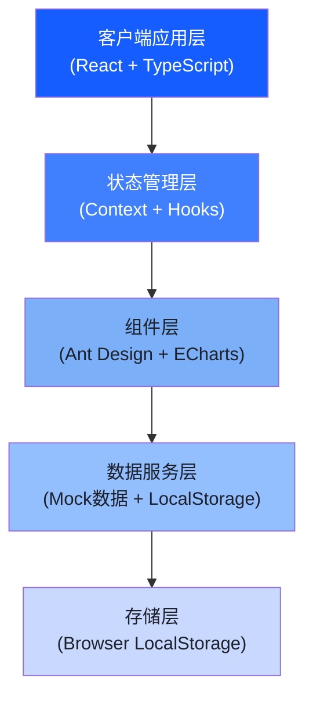
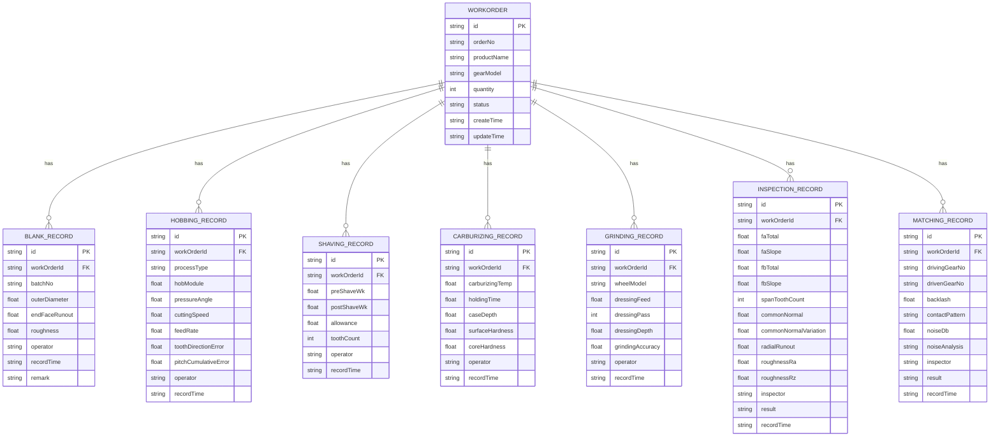

## 1. 架构设计



## 2. 技术描述

- 前端：React@18 + TypeScript@5 + Vite@5
- UI组件库：Ant Design@5
- 图表库：ECharts@5
- 样式方案：TailwindCSS@3 + CSS Modules
- 初始化工具：Vite官方脚手架
- 后端：无（纯前端实现，Mock数据）
- 数据持久化：Browser LocalStorage
- 路由：React Router@6

## 3. 路由定义

| 路由 | 用途 |
|------|------|
| /dashboard | 工作台首页 - 数据概览与快捷入口 |
| /process/blank | 齿坯加工 - 外圆车削记录 |
| /process/hobbing | 滚齿插齿 - 滚齿/插齿/键槽 |
| /process/shaving | 剃齿珩齿 - 剃齿余量控制 |
| /process/carburizing | 渗碳淬火 - 渗碳层检测 |
| /process/grinding | 磨齿精加工 - 砂轮修整 |
| /inspection | 齿形检测 - 四项检测数据 |
| /matching | 配对啮合 - 配对与噪声检验 |
| /workorders | 工单管理 - 工单列表 |
| /workorders/:id | 工单详情 - 全流程追溯 |

## 4. 数据模型

### 4.1 数据模型ER图



### 4.2 核心数据结构TypeScript定义

```typescript
interface WorkOrder {
  id: string;
  orderNo: string;
  productName: string;
  gearModel: string;
  quantity: number;
  status: 'pending' | 'processing' | 'completed' | 'rejected';
  processProgress: {
    blank: boolean;
    hobbing: boolean;
    shaving: boolean;
    carburizing: boolean;
    grinding: boolean;
    inspection: boolean;
    matching: boolean;
  };
  createTime: string;
  updateTime: string;
}

interface BlankRecord {
  id: string;
  workOrderId: string;
  batchNo: string;
  outerDiameter: number;      // 外圆直径(mm)
  outerDiameterTolerance: string;
  endFaceRunout: number;      // 端面跳动(μm)
  roughness: number;          // 粗糙度Ra(μm)
  operator: string;
  recordTime: string;
  remark?: string;
}

interface HobbingRecord {
  id: string;
  workOrderId: string;
  processType: '滚齿' | '插齿' | '键槽';
  hobModel?: string;
  hobModule: number;           // 滚刀模数
  pressureAngle: number;       // 压力角
  cuttingSpeed: number;        // 切削速度(m/min)
  feedRate: number;            // 进给量(mm/r)
  toothDirectionError?: number;  // 齿向误差(μm)
  pitchCumulativeError?: number; // 齿距累积误差(μm)
  keywayWidth?: number;         // 键槽宽度(mm)
  keywayDepth?: number;         // 键槽深度(mm)
  symmetry?: number;            // 对称度(μm)
  operator: string;
  recordTime: string;
}

interface InspectionRecord {
  id: string;
  workOrderId: string;
  faTotal: number;          // 齿形总偏差
  faSlope: number;          // 齿形斜率偏差
  fbTotal: number;          // 齿向总偏差
  fbSlope: number;          // 齿向斜率偏差
  spanToothCount: number;   // 跨齿数
  commonNormal: number;     // 公法线长度
  commonNormalVariation: number; // 公法线变动量
  radialRunout: number;     // 齿圈径向跳动
  roughnessRa: number;      // 粗糙度Ra
  roughnessRz: number;      // 粗糙度Rz
  inspector: string;
  result: 'qualified' | 'unqualified';
  recordTime: string;
}
```

## 5. 项目目录结构

```
src/
├── assets/             # 静态资源
│   └── images/
├── components/         # 通用组件
│   ├── Layout/         # 布局组件
│   │   ├── Sidebar.tsx
│   │   ├── Header.tsx
│   │   └── index.tsx
│   ├── ProcessCard/    # 工序卡片
│   ├── StatCard/       # 指标卡片
│   ├── DataTable/      # 数据表格
│   └── FormFields/     # 表单字段
├── pages/              # 页面组件
│   ├── Dashboard/      # 工作台
│   ├── Blank/          # 齿坯加工
│   ├── Hobbing/        # 滚齿插齿
│   ├── Shaving/        # 剃齿珩齿
│   ├── Carburizing/    # 渗碳淬火
│   ├── Grinding/       # 磨齿精加工
│   ├── Inspection/     # 齿形检测
│   ├── Matching/       # 配对啮合
│   └── WorkOrder/      # 工单管理
├── hooks/              # 自定义Hooks
│   ├── useLocalStorage.ts
│   └── useWorkOrderFlow.ts
├── mock/               # Mock数据
│   ├── workOrders.ts
│   └── records.ts
├── store/              # 状态管理
│   ├── WorkOrderContext.tsx
│   └── RecordContext.tsx
├── types/              # TypeScript类型
│   └── index.ts
├── utils/              # 工具函数
│   ├── formatters.ts
│   ├── validators.ts
│   └── idGenerator.ts
├── App.tsx
├── main.tsx
└── index.css
```

## 6. 关键技术决策

1. **状态管理**：使用React Context + useReducer管理全局工单和记录数据，避免过度设计
2. **数据持久化**：LocalStorage存储，自动序列化/反序列化，首次访问注入Mock数据
3. **表单方案**：Ant Design Form组件，配合自定义校验规则实现工业参数校验
4. **图表方案**：ECharts实现检测数据可视化（误差分布图、趋势图、雷达图）
5. **响应式**：TailwindCSS响应式断点 + Ant Design Grid系统
